# Stickman-AssetPack-FlipperZero
Stickman Asset Pack for the momentum firmware on Flipper Zero

I also added all the aseprite and png files to make it simple for anyone to modify :)

# Download
Move the Stickman folder to your asset_packs folder

# Images

### Main menu animation
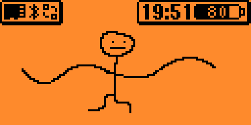

### Passport

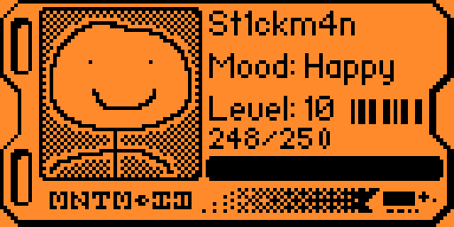

### Lockscreen
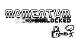

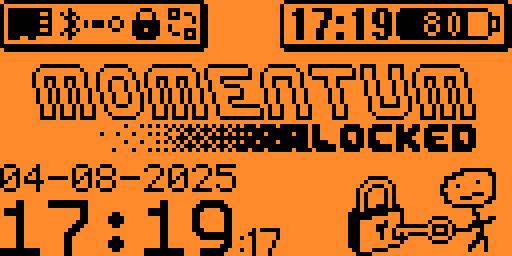

### SubGhz screens
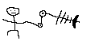
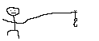

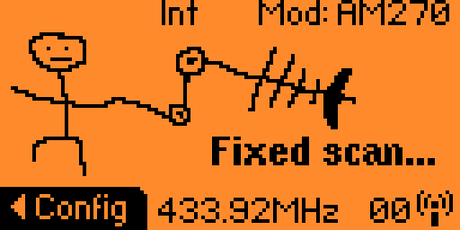
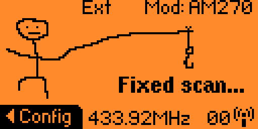

### BLE Pairing
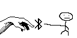

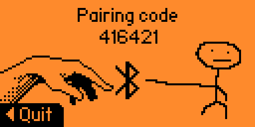

### U2F
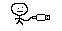
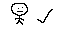
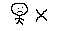
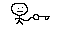

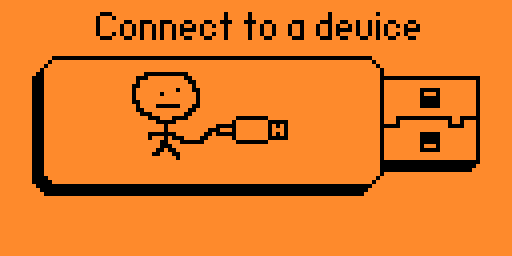

### Turn OFF

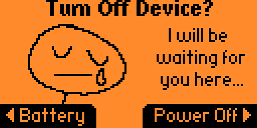

### Infrared
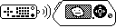

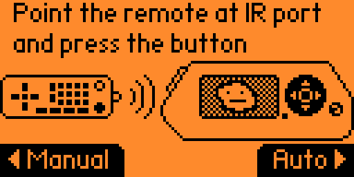

### Save
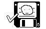

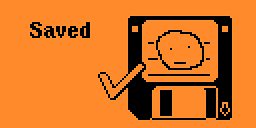

### Emulation
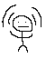

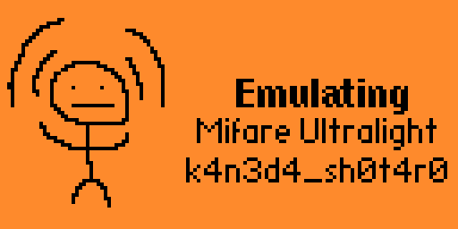

### Warning
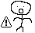
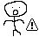

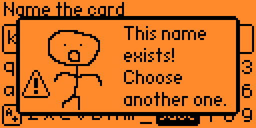

### iButton waiting

### iButton write
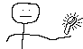

### Success
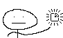

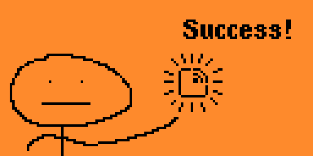

### Delete
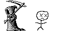

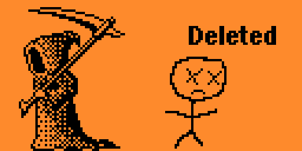

### Done
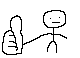

### IR Read
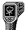

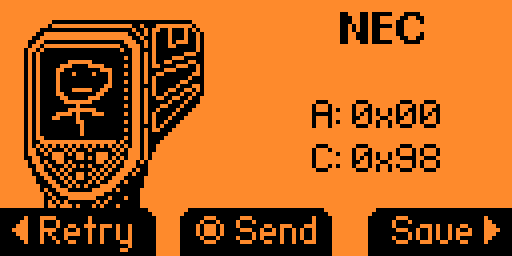

### RFID Raw
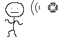
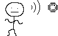

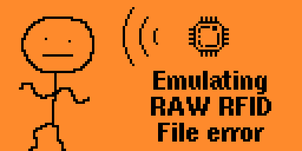

### Level Up Animation
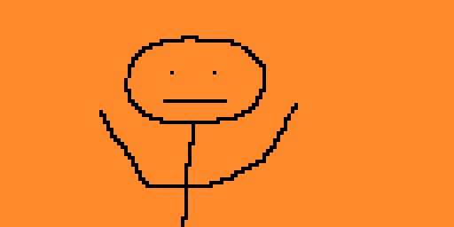